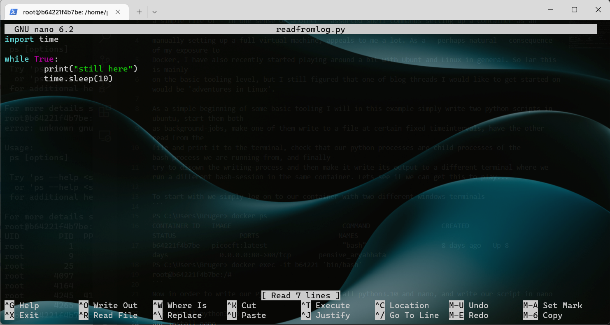

## First few steps in Linux


At my previous job I got exposed to Docker for the first time in my professional carreer. The idea of having something similar to a tiny virtual machine running on your local machine, and being able to setup rebuild the container from the operating system and up using a simple Dockerfile of assorted shell-commands appeals to me a lot. As a consequence of my exposure to Docker, I have also recently started playing around with Ubunt and Linux in general. So far this is mainly
on the level of getting acquainted with the tooling and playing around, burt I figured this could be as good a occasion as any to start a bit of blogging. Whether this will be a one off, or the beginning of a 'adventures in Linux'-thread time will tell.

As a simple beginning of some basic tooling I will in this example simply write two python-scripts in ubuntu, start them both
as background-jobs, make one of them write to a file at certain fixed time-intervals, have the other read from the 
file and print it to the terminal, check that our python processes are child-processes of the bash-process we are running from, and finally
try to disown the writing-process and then make it write its output to a different terminal where we run a different bash-session in the same container. Lets see if we can get the container to play along...

Let us start by getting the containers up and running. As we will be playing with Ubuntu in this blog-post we will start by simply pulling the image `ubuntu:latest`: 
```
docker pull ubuntu:latest
``` 


To interact with this images we migth either create a Dockerfile describing how to set up a given container, build the container from the Dockerfile, and then start this. Or we may simply use ```docker run``` to run a command in a new docker container. 
```
docker run -i -d ubuntu:latest '/bin/bash'
```
<details markdown=block>
<summary markdown=span>A few remarks to help bug-hunting when free-styling yourself</summary>

- Note here the `-i` which will keep stdin open, to avoid the docker-container from simply exiting immediately - if this is forgotten the container will simply exit immediately.
- The `-d` flag will run the container i detached mode. This means that the terminal we are using will not automatically be used by the container for stdin and stdout. Instead we will connect to the running container manually from other terminals, see below.  
- Finally one should keep in mind that this command will run a given command in a new container - if the final command is forgotten the container will fail, but to see the error-message we will need to use the command 
```
docker run ubuntu:latest --verbose
```
where the `-verbose` flag is of course what allows us to get a more detailed error-message.
</details>
 


To start with we simply log on to our container with two different windows terminals
```
PS C:\Users\Bruger> docker ps
CONTAINER ID   IMAGE                            COMMAND                  CREATED      STATUS                PORTS                    NAMES
b64221f4b7be   ubuntu:latest                   "bash"                   8 days ago   Up 8 days             0.0.0.0:80->80/tcp       pensive_aryabhata
PS C:\Users\Bruger> docker exec -it b64221 'bin/bash'
root@b64221f4b7be:/#
```
Now in order to write our Python-scripts we install python3.10 and nano, and write our script in nano
```
apt install python3.10
apt install nano
```
This gives us the following nice little terminal-based gui to write out Python in:


Let us edit our Python files a bit so one of them writes to a file and the other one reads from the file and prints to screen - as promised.

```python
#writer.py
import time

while True:
        f = open('output.txt', mode='a') #open for writing append at end.
        f.write("test" + str(time.asctime()))
        f.close()
        time.sleep(20) #sleep for 20 sec
```

```python
#reader.py
import time

while True:
        f = open('output.txt') #default is open for reading
        line =f.readlines()
        print(line[-1])
        f.close()
        time.sleep(20)
```

Could hardly be more basic. Lets start them as background jobs in our bash-session: 
```
root@b64221f4b7be:/home/python# python3.10 writer.py &
[1] 4363
root@b64221f4b7be:/home/python# cat output.txt
testFri Dec  9 19:49:49 2022root@b64221f4b7be:/home/python#
root@b64221f4b7be:/home/python#
root@b64221f4b7be:/home/python# cat output.txt
testFri Dec  9 19:49:49 2022root@b64221f4b7be:/home/python#
root@b64221f4b7be:/home/python# python3.10 reader.py &
[2] 4366
```
Note the `&` which ensures that they will run as background jobs and hence not hold on to stdin and stdout, i.e. to our terminal. 

Lets us list the jobs
```
root@b64221f4b7be:/home/python# jobs
[1]-  Running                 python3.10 writer.py &
[2]+  Running                 python3.10 reader.py &
```
We can also use `ps -f` to list relevant info about processes which are running
```
root@b64221f4b7be:/home/python# ps -f
UID        PID  PPID  C STIME TTY          TIME CMD
root      4266     0  0 19:19 pts/4    00:00:00 bin/bash
root      4363  4266  0 19:49 pts/4    00:00:00 python3.10 writer.py
root      4366  4266  0 19:50 pts/4    00:00:00 python3.10 reader.py
root      4370  4266  0 19:52 pts/4    00:00:00 ps -f
```
At this point we get regular updates in our terminal about what is in the file `output.txt` - as expected. 

Note the PPID-column above which gives the id of the parent-process of a given process. We note that all three processes we started (reader, writer, ps) are subprocesses of the bash-process we are working in. It is however at first glance a little curious that we cannot see the other bash-process we have started through another terminal. However, this is merely a question of the right flags, use `ps -f -A´ and we find
```
root@b64221f4b7be:/home/python# ps -f -A
UID        PID  PPID  C STIME TTY          TIME CMD
root         1     0  0 Dec08 pts/0    00:00:00 bash
root         9     0  0 Dec08 pts/1    00:00:00 /bin/bash
root        25     9  0 Dec08 pts/1    00:00:00 bash
root      4097     0  0 Dec08 pts/2    00:00:00 /bin/bash
root      4164     0  0 18:23 pts/3    00:00:00 bin/bash
root      4266     0  0 19:19 pts/4    00:00:00 bin/bash
root      4363  4266  0 19:49 pts/4    00:00:00 python3.10 writer.py
root      4366  4266  0 19:50 pts/4    00:00:00 python3.10 reader.py
root      4372  4266  0 19:57 pts/4    00:00:00 ps -f -A
```
(all this flag-gymnastics is of course deciphered along the way by using `ps --help`). Ocay, so so far things are going well, allthough the attentive reader will notice that I have quite a few bashes open - to find the one used in a given terminal we use `echo $$`:
```
root@b64221f4b7be:/home/python# echo $$
4266
```

The real challenge - at least for me - was to try and redirect the output of our reader.py to the other terminal... To do this we need to take a look at the TTY-column above as this will list the devices (essentially an abstraction over the idea of a device allowing a user to interact with the system). Lets try to restart our reader.py from the terminal from where it is running, and then redirect its outout to a different terminal. To do this we will carry out the following steps:
- Identity the PID og the bash-process running in the terminal where we want to output printed.
-  determine the device of this terminal (read off the TTY-column).
- Restart `writer.py` from out original terminal, but as a background-process where we redirect stdout to a specific device, namely the one read of the TTY-column.

From the receiving terminal we now find 
```
root@b64221f4b7be:/home/python# echo $$
4164
```
and from the original terminal we find
```
root@b64221f4b7be:/home/python# echo $$
4266
root@b64221f4b7be:/home/python# ps -f -A
UID        PID  PPID  C STIME TTY          TIME CMD
root         1     0  0 Dec08 pts/0    00:00:00 bash
root         9     0  0 Dec08 pts/1    00:00:00 /bin/bash
root        25     9  0 Dec08 pts/1    00:00:00 bash
root      4097     0  0 Dec08 pts/2    00:00:00 /bin/bash
root      4164     0  0 18:23 pts/3    00:00:00 bin/bash
root      4266     0  0 19:19 pts/4    00:00:00 bin/bash
root      4363  4266  0 19:49 pts/4    00:00:00 python3.10 writer.py
root      4403  4266  0 20:21 pts/4    00:00:00 ps -f -A
root@b64221f4b7be:/home/python# (python3.10 reader.py &) > /dev/pts/3
root@b64221f4b7be:/home/python# ps -f -A
UID        PID  PPID  C STIME TTY          TIME CMD
root         1     0  0 Dec08 pts/0    00:00:00 bash
root         9     0  0 Dec08 pts/1    00:00:00 /bin/bash
root        25     9  0 Dec08 pts/1    00:00:00 bash
root      4097     0  0 Dec08 pts/2    00:00:00 /bin/bash
root      4164     0  0 18:23 pts/3    00:00:00 bin/bash
root      4266     0  0 19:19 pts/4    00:00:00 bin/bash
root      4363  4266  0 19:49 pts/4    00:00:00 python3.10 writer.py
root      4405     1  0 20:22 pts/4    00:00:00 python3.10 reader.py
root      4406  4266  0 20:22 pts/4    00:00:00 ps -f -A
root@b64221f4b7be:/home/python# jobs
[1]+  Running                 python3.10 writer.py &
```
This will all work as expected however we do note that apparently the reader now has a different parent process. Also we note that when we list the jobs started from our current terminal we no longer get our reader-process listed. Last curious detail that should be mentioned; if we write `python3.10 reader.py & > /dev/pts/3` instead of `(python3.10 reader.py &) > /dev/pts/3`, the command will not work, presumably since `&>` has a different meaning in bash, and `& >` will be interpreted as such.

Let us end with a bit of clean-up of the many bash-processes floating around by now.
```
root@b64221f4b7be:/home/python# ps -f -A
UID        PID  PPID  C STIME TTY          TIME CMD
root         1     0  0 Dec08 pts/0    00:00:00 bash
root         9     0  0 Dec08 pts/1    00:00:00 /bin/bash
root        25     9  0 Dec08 pts/1    00:00:00 bash
root      4097     0  0 Dec08 pts/2    00:00:00 /bin/bash
root      4164     0  0 18:23 pts/3    00:00:00 bin/bash
root      4266     0  0 19:19 pts/4    00:00:00 bin/bash
root      4363  4266  0 19:49 pts/4    00:00:00 python3.10 writer.py
root      4405     1  0 20:22 pts/4    00:00:00 python3.10 reader.py
root      4407  4266  0 20:36 pts/4    00:00:00 ps -f -A
root@b64221f4b7be:/home/python# kill 4405
root@b64221f4b7be:/home/python# kill 4363
root@b64221f4b7be:/home/python# ps -f -A
UID        PID  PPID  C STIME TTY          TIME CMD
root         1     0  0 Dec08 pts/0    00:00:00 bash
root         9     0  0 Dec08 pts/1    00:00:00 /bin/bash
root        25     9  0 Dec08 pts/1    00:00:00 bash
root      4097     0  0 Dec08 pts/2    00:00:00 /bin/bash
root      4164     0  0 18:23 pts/3    00:00:00 bin/bash
root      4266     0  0 19:19 pts/4    00:00:00 bin/bash
root      4408  4266  0 20:36 pts/4    00:00:00 ps -f -A
[1]+  Terminated              python3.10 writer.py
root@b64221f4b7be:/home/python# jobs
root@b64221f4b7be:/home/python# ps -f -A
UID        PID  PPID  C STIME TTY          TIME CMD
root         1     0  0 Dec08 pts/0    00:00:00 bash
root         9     0  0 Dec08 pts/1    00:00:00 /bin/bash
root        25     9  0 Dec08 pts/1    00:00:00 bash
root      4097     0  0 Dec08 pts/2    00:00:00 /bin/bash
root      4164     0  0 18:23 pts/3    00:00:00 bin/bash
root      4266     0  0 19:19 pts/4    00:00:00 bin/bash
root      4409  4266  0 20:36 pts/4    00:00:00 ps -f -A
root@b64221f4b7be:/home/python# exit
exit
root@b64221f4b7be:/# ps -f -A
UID        PID  PPID  C STIME TTY          TIME CMD
root         1     0  0 Dec08 pts/0    00:00:00 bash
root         9     0  0 Dec08 pts/1    00:00:00 /bin/bash
root      4097     0  0 Dec08 pts/2    00:00:00 /bin/bash
root      4414     9  0 20:39 pts/1    00:00:00 ps -f -A
root@b64221f4b7be:/# echo $$
9
root@b64221f4b7be:/# bash
root@b64221f4b7be:/# ps -f -A
UID        PID  PPID  C STIME TTY          TIME CMD
root         1     0  0 Dec08 pts/0    00:00:00 bash
root         9     0  0 Dec08 pts/1    00:00:00 /bin/bash
root      4097     0  0 Dec08 pts/2    00:00:00 /bin/bash
root      4415     9  0 20:39 pts/1    00:00:00 bash
root      4418  4415  0 20:39 pts/1    00:00:00 ps -f -A
```s

Bemærk at de forskellige bash-kommandoer kan dræbes med kill-kommandoer, pånær den øverste, der åbenbart vil stoppe containeren hvis den dræbes. 
